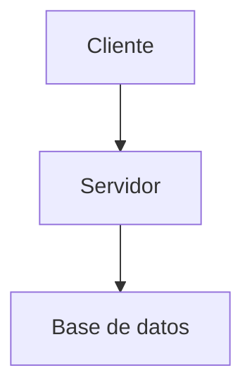

# Diagramas y video

## Diagrama Mermaid



## Video de YouTube

El cuerpo del fence es `<videoId> | <título>`.

```youtube
dQw4w9WgXcQ | Video de ejemplo
```

## Visualizador de Beans (solo cursos de Java/Spring)

Si tu curso no es de Java/Spring simplemente no uses este bloque — es inofensivo si no aparece en ninguna lección.

```beansim
@Component
public class ServicioEjemplo {
    @Autowired
    private RepositorioEjemplo repositorio;
}
```
